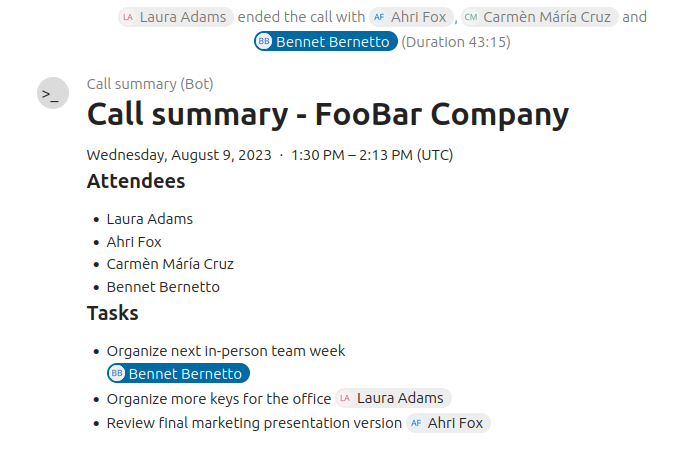
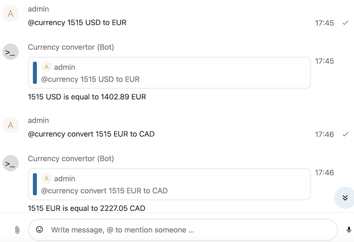
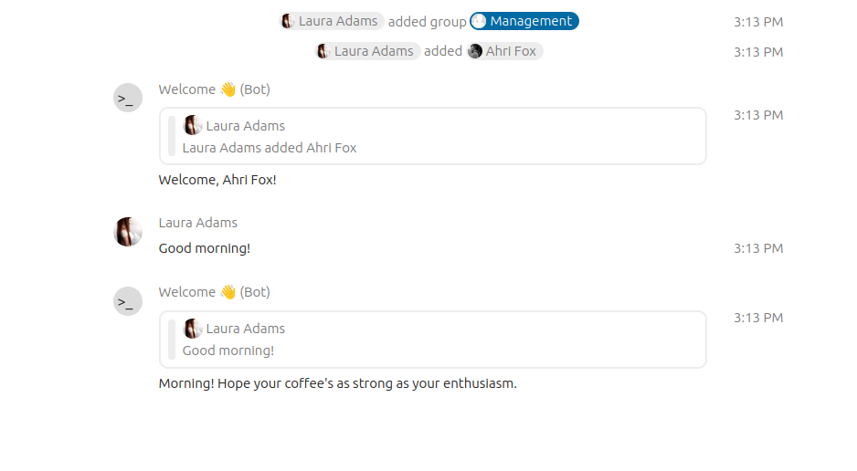
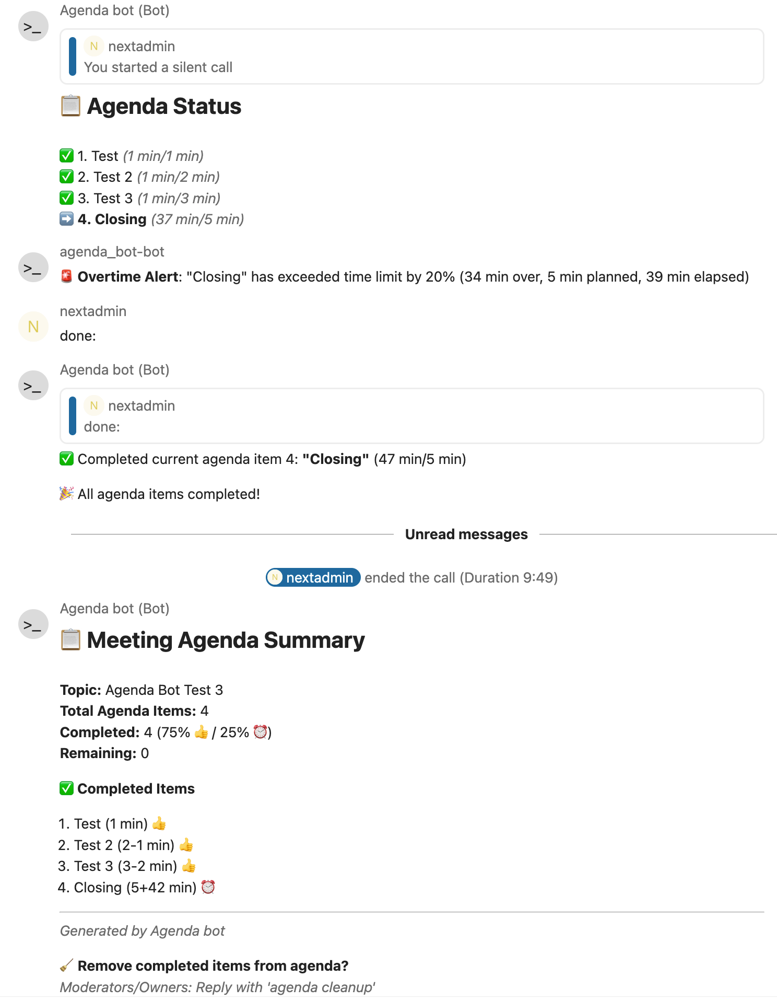
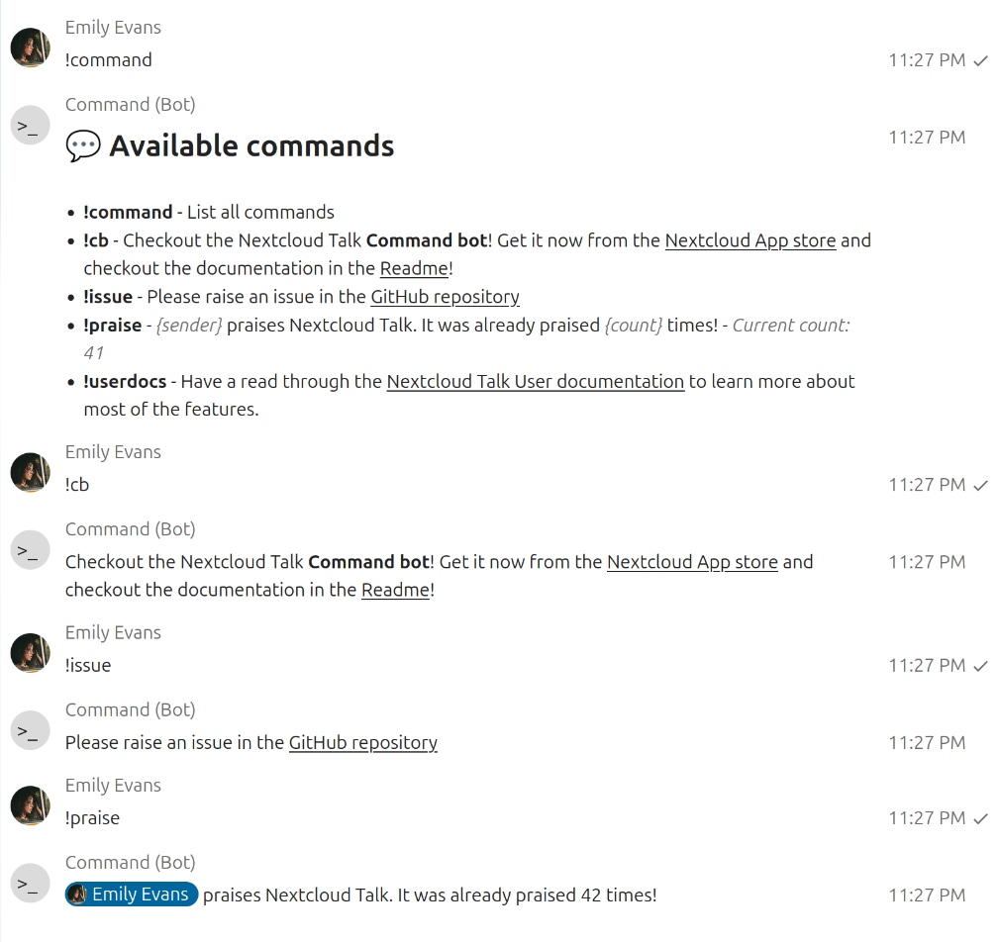
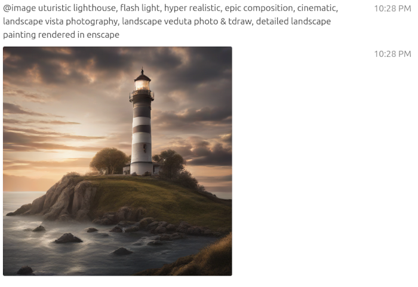

# List of available bots

If you want to write your own bot or webhook, please see the
[Bots and Webhooks developer documentation](bots.md). Afterwards send a pull
request against the [docs/bot-list.md](https://github.com/nextcloud/spreed/blob/main/docs/bot-list.md)
to add your bot to the list, using the following template:

```markdown
### Name of the bot

Useful, but short description, best to keep it to 1-3 lines of text.


* License: Identifier of the license (See https://spdx.org/licenses/)
* [Link to source code](https://github.com/nextcloud/call_summary_bot)
* [Link to installation documentation](https://github.com/nextcloud/call_summary_bot#readme)
```

Here you can find a brief overview of known bots that allows administration to
easily discover your bot and install it on their Nextcloud server.

## Samples

### Call summary (Nextcloud app sample)

The call summary bot posts an overview message after the call listing all participants and outlining tasks.



* License: AGPL-3.0-or-later
* [Link to source code](https://github.com/nextcloud/call_summary_bot)
* [Link to installation documentation](https://github.com/nextcloud/call_summary_bot#readme)

### Currency convertor (Nextcloud AppEcosystem sample)

Example of how easily bot can be implemented in Python.



* License: MIT
* [Link to source code](https://github.com/cloud-py-api/nc_py_api/tree/main/examples/as_app/talk_bot)
* [Link to installation documentation](https://github.com/cloud-py-api/nc_py_api/blob/main/examples/as_app/talk_bot/HOW_TO_INSTALL.md)

### Welcome bot (Golang sample)

A Golang sample bot that responds to "Good morning" and "Hello" and welcomes new attendees in the room.



* License: GPL-3.0-or-later
* [Link to source code](https://github.com/nextcloud/welcome_bot)
* [Link to installation documentation](https://github.com/nextcloud/welcome_bot#readme)

## Bots

### Agenda Bot

Intelligent meeting agenda management bot for Nextcloud Talk with

- Advanced Agenda Management
- Intelligent Time Monitoring
- Permission-Based Access Control
- Smart Bot Integration
- Transform chaotic meetings into productive sessions!



* License: AGPL-3.0-or-later
* [Link to source code](https://github.com/LexioJ/agenda_bot)
* [Link to installation documentation](https://github.com/LexioJ/agenda_bot#installation)

### Command Bot

A simple "text in, text out" bot to help with repeating questions and tasks



* License: AGPL-3.0-or-later
* [Link to source code](https://github.com/nextcloud/command_bot)
* [Link to installation documentation](https://github.com/nextcloud/command_bot#command-bot-for-nextcloud-talk)

### Stable Diffusion

Uses [SDXL-Turbo](https://huggingface.co/stabilityai/sdxl-turbo) for fast image generation. Usage example: `@image cinematic portrait of fluffy cat with black eyes`



* License: MIT
* [Link to source code](https://github.com/cloud-py-api/ai_image_generator_bot)
* [Link to installation documentation](https://github.com/cloud-py-api/ai_image_generator_bot#readme)
