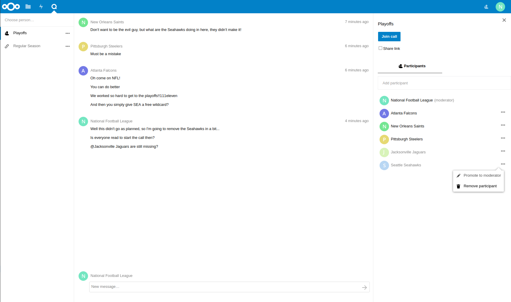

# Nextcloud Talk Documentation

## User documentation

* [User system requirements](user-requirements.md)
* [User feature documentation ↗](https://docs.nextcloud.com/server/latest/user_manual/en/talk/index.html)

## Administration documentation

* [Server system requirements](system-requirements.md)
* [Quick install](quick-install.md)
* [Configuring a TURN server](TURN.md)
	* [Configuring coTURN](coturn.md)
	* [Configuring eturnal](eturnal.md)
* [Scalability](scalability.md)
* [Call experience](call-experience.md)
* [Sample conversations](sample-conversations.md)
* [Occ commands](occ.md)
* [Bots](bot-list.md)
* [Matterbridge integration](matterbridge.md)

## Developer documentation

* [Developer setup](developer-setup.md)
* [Bots and webhooks](bots.md)
* [Constants](constants.md)
* [Capabilities](capabilities.md)
* [PHP Events](events.md)

## API documentation

* [Global API status and headers](global.md)
* [Conversation management](conversation.md)
* [Conversation avatar management](avatar.md)
* [Participant management](participant.md)
* [Call management](call.md)
* [Call recording management](recording.md)
* [Chat management](chat.md)
* [Reaction management](reaction.md)
* [Poll management](poll.md)
* [Breakout rooms management](breakout-rooms.md)
* [Bots management](bot-management.md)
* [Integration by other apps](integration.md)
* [Webinar management](webinar.md)
* [Settings management](settings.md)
* [Internal Signaling API](internal-signaling.md)
* [Standalone Signaling API ↗](https://nextcloud-spreed-signaling.readthedocs.io/en/latest/)
