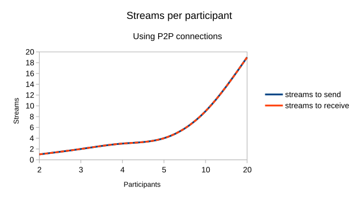

# Scalability

Talk works peer to peer, that is, each participant sends an end-to-end encrypted stream to every other participant and receives one stream per other participant. Bandwidth usage grows with the number of participants.

A single video stream currently uses about 1 Mbit/sec and the total required bandwidth can be calculated as follows:

```
1 Mbit/s * (participants - 1)
```



This means that in a call with 5 participants, each has to send and receive about 4 Mbit/sec. Given the asymmetric nature of most typical broadband connections, it's sending video that quickly becomes the bottleneck. Moreover, decoding all those video streams puts a big strain on the system of each participant.

To limit and CPU bandwidth usage, participants can disable video. This will drop the bandwidth use to audio only, about 50 kbit/sec (about 1/20th of the bandwidth of video), eliminating most decoding work. When all participants are on a fast network, a call with 20 people without video could be doable.

Still a call creates a load on the participants' browsers (decoding streams) and on the server as it handles signaling. This, for example, also has consequences for devices that support calls. Mobile device browsers will sooner run out of compute capacity and cause issues to the call. While we continuously work to optimize Talk for performance, there is still work to be done so it is not unlikely that the bottleneck will be there for the time being. We very much welcome help in optimization of calls!

### How to have the maximum number of participants in a call

To make sure a call can sustain the largest number of participants, make sure that:

* each participant has a fast upload and download.
* each participant has a fast enough system. This means:

    - on a desktop/laptop system, a browser like Firefox or Chrome should be used. The WebRTC implementation in other browsers is often sub-par. On a laptop, the power cord should be plugged in - this often results in better CPU performance.
    - on mobile devices, the Android/iOS apps should be used because mobile browsers will run out of computing power quickly.

* all participant disables their video streams.


With this setup, 20 users should be possible in a typical setup.

### Scaling beyond 5-20 users in a call

Nextcloud offers a partner product, the Talk High Performance Back-end, which deals with this scalability issue by including a Selective Forwarding Unit (SFU). Each participant sends one stream to the SFU which distributes it under the participants. This typically scales to 30-50 or even more active participants. Furthermore, the HPB setup also allows calls with hundreds of passive participants. With this number of participants is only limited by the bandwidth of the SFU setup. This is ideal for one-to-many streaming like webinars or remote teaching lessons.

The HPB also takes care of signaling, decreasing the load of many calls on the Talk server and optional SIP integration so users can dial in to calls by phone.

If you need to use Talk in an enterprise environment, [contact our sales team](https://nextcloud.com/enterprise/buy/) for access to the Talk High Performance Back-end. See our website for more details and [pricing](https://nextcloud.com/talk/#scalability).
