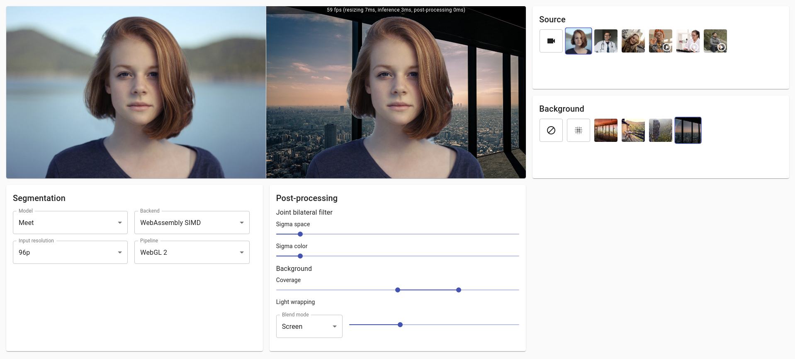

# Virtual Background

> Demo on adding virtual background to a live video stream in the browser.

:point_right: [Try it live here!](https://volcomix.github.io/virtual-background)

## Table of contents

- [Implementation details](#implementation-details)
  - [BodyPix](#bodypix)
  - [MediaPipe Meet Segmentation](#mediapipe-meet-segmentation)
    - [Building TFLite to WebAssembly](#building-tflite-to-webassembly)
    - [Canvas 2D + CPU](#canvas-2d--cpu)
    - [WebGL 2](#webgl-2)
  - [ML Kit Selfie Segmentation](#ml-kit-selfie-segmentation)
- [Performance](#performance)
- [Possible improvements](#possible-improvements)
- [Related work](#related-work)
- [Running locally](#running-locally)
- [Building TensorFlow Lite tool](#building-tensorflow-lite-tool)

## Implementation details

In this demo you can switch between 3 different ML pre-trained segmentation models:

- [BodyPix](https://github.com/tensorflow/tfjs-models/blob/master/body-pix)
- [MediaPipe Meet Segmentation](https://mediapipe.page.link/meet-mc)
- [ML Kit Selfie Segmentation](https://developers.google.com/ml-kit/vision/selfie-segmentation)

### BodyPix

The drawing utils provided in BodyPix are not optimized for the simple background image use case of this demo. That's why I haven't used [toMask](https://github.com/tensorflow/tfjs-models/tree/master/body-pix#bodypixtomask) nor [drawMask](https://github.com/tensorflow/tfjs-models/tree/master/body-pix#bodypixdrawmask) methods from the API to get a higher framerate.

The [drawBokehEffect](https://github.com/tensorflow/tfjs-models/tree/master/body-pix#bodypixdrawbokeheffect) method from BodyPix API is not used. Instead, [CanvasRenderingContext2D.filter](https://developer.mozilla.org/en-US/docs/Web/API/CanvasRenderingContext2D/filter) property is configured with [blur](<https://developer.mozilla.org/en-US/docs/Web/CSS/filter#blur()>) and [CanvasRenderingContext2D.globalCompositeOperation](https://developer.mozilla.org/en-US/docs/Web/API/CanvasRenderingContext2D/globalCompositeOperation) is setup to blend the different layers according to the segmentation mask.

The result provides an interesting framerate on laptop but is not really usable on mobile (see [Performance](#performance) for more details). On both devices, the segmentation lacks precision compared to Meet segmentation model.

**Note: BodyPix relies on the default TensorFlow.js backend for your device (i.e. `webgl` usually). The [WASM backend](https://github.com/tensorflow/tfjs/tree/master/tfjs-backend-wasm) seems to be slower for this model, at least on MacBook Pro.**

### MediaPipe Meet Segmentation

Meet segmentation model is only available as a [TensorFlow Lite](https://www.tensorflow.org/lite) model file. Few approaches are discussed in [this issue](https://github.com/tensorflow/tfjs/issues/4177) to convert and use it with TensorFlow.js but I decided to try implementing something closer to Google original approach described in [this post](https://ai.googleblog.com/2020/10/background-features-in-google-meet.html). Hence the demo relies on a small WebAssembly tool built on top of [TFLite](https://blog.tensorflow.org/2020/07/accelerating-tensorflow-lite-xnnpack-integration.html) along with [XNNPACK](https://github.com/google/XNNPACK) delegate and [SIMD](https://github.com/WebAssembly/simd) support.

**Note: [Meet segmentation model card](https://mediapipe.page.link/meet-mc) was initially released under [Apache 2.0](http://www.apache.org/licenses/LICENSE-2.0) license (read more [here](https://github.com/tensorflow/tfjs/issues/4177) and [here](https://github.com/google/mediapipe/issues/1460)) but seems to be switched to [Google Terms of Service](https://policies.google.com/terms?hl=en-US) since Jan 21, 2021. Not sure what it means for this demo. [Here](docs/meet-segmentation-model-card-2020-10-12.pdf) is a copy of the model card matching the model files used in this demo**

#### Building TFLite to WebAssembly

You can find the source of the TFLite inference tool in the [tflite directory](./tflite) of this repository. Instructions to build TFLite using Docker are described in a dedicated section: [Building TensorFlow Lite tool](#building-tensorflow-lite-tool).

- The Bazel WORKSPACE configuration is inspired from [MediaPipe repository](https://github.com/google/mediapipe/blob/master/WORKSPACE).
- Emscripten toolchain for Bazel was setup following [Emsdk repository instructions](https://github.com/emscripten-core/emsdk/tree/master/bazel) and changed to match [XNNPACK build config](https://github.com/google/XNNPACK/blob/ec0bf144ad55cde0698083f12e0a20d4525689a6/BUILD.bazel#L7340).
- TensorFlow source [is patched](tflite/Dockerfile) to match Emscripten toolchain and WASM CPU.
- C++ functions are [called directly from JavaScript](https://emscripten.org/docs/porting/connecting_cpp_and_javascript/Interacting-with-code.html#call-compiled-c-c-code-directly-from-javascript) to achieve the best performance.
- [Memory is accessed directly](https://emscripten.org/docs/porting/emscripten-runtime-environment.html#emscripten-memory-representation) from JavaScript through pointer offsets to exchange image data with WASM.

#### Canvas 2D + CPU

This rendering pipeline is pretty much the same as for BodyPix. It relies on Canvas compositing properties to blend rendering layers according to the segmentation mask.

Interactions with TFLite inference tool are executed on CPU to convert from UInt8 to Float32 for the model input and to apply softmax on the model output.

#### WebGL 2

The WebGL 2 rendering pipeline relies entirely on `webgl2` canvas context and GLSL shaders for:

- Resizing inputs to fit the segmentation model (there are still CPU operations to copy from RGBA UInt8Array to RGB Float32Array in TFLite WASM memory).
- [Softmax](https://en.wikipedia.org/wiki/Softmax_function) on segmentation model output to get the probability of each pixel to be a person.
- Joint bilateral filter to smooth the segmentation mask and to preserve edges from the original input frame (implementation based on [MediaPipe repository](https://github.com/google/mediapipe/blob/master/mediapipe/calculators/image/bilateral_filter_calculator.cc)).
- Blending background image with [light wrapping](https://www.imaging-resource.com/news/2016/02/11/create-natural-looking-composite-images-using-light-wrapping-technique).
- Original input frame background blur. Great articles [here](https://rastergrid.com/blog/2010/09/efficient-gaussian-blur-with-linear-sampling/) and [here](https://software.intel.com/content/www/us/en/develop/blogs/an-investigation-of-fast-real-time-gpu-based-image-blur-algorithms.html).

### ML Kit Selfie Segmentation

[Thanks to @RemarkableGuy for pointing out this model.](https://github.com/Volcomix/virtual-background/issues/2)

[Selfie segmentation](https://developers.google.com/ml-kit/vision/selfie-segmentation) model's architecture is very close to the one of Meet segmentation and they both seem to be generated from the same Keras model (see [this issue](https://github.com/Volcomix/virtual-background/issues/2) for more details). It is released under [Apache 2.0](http://www.apache.org/licenses/LICENSE-2.0) and you can find in this repo a [copy of the model card](docs/mlkit-selfie-model-card-2021-02-16.pdf) matching the model used in this demo (here is the [original current model card](https://developers.google.com/ml-kit/images/vision/selfie-segmentation/selfie-model-card.pdf)). The model was extracted from its [official artifact](https://mvnrepository.com/artifact/com.google.mlkit/segmentation-selfie/16.0.0-beta1).

Unlike what is described in the model card, the output of the model is a single channel allowing to get a float value of the segmentation mask. Besides that, the model is inferred using the exact same pipeline as Meet segmentation. However, the model does not perform as well as Meet segmentation because of its higher input resolution (see [Performance](#performance) for more details), even though it still offers better quality segmentation than BodyPix.

## Performance

Here are the performance observed for the whole rendering pipelines, including inference and post-processing, when using the device camera on smartphone **Pixel 3 (Chrome)**.

| Model   | Input resolution | Backend          | Pipeline        | FPS |
| ------- | ---------------- | ---------------- | --------------- | --- |
| BodyPix | 640x360          | WebGL            | Canvas 2D + CPU | 11  |
| ML Kit  | 256x256          | WebAssembly      | Canvas 2D + CPU | 9   |
| ML Kit  | 256x256          | WebAssembly      | WebGL 2         | 9   |
| ML Kit  | 256x256          | WebAssembly SIMD | Canvas 2D + CPU | 17  |
| ML Kit  | 256x256          | WebAssembly SIMD | WebGL 2         | 19  |
| Meet    | 256x144          | WebAssembly      | Canvas 2D + CPU | 14  |
| Meet    | 256x144          | WebAssembly      | WebGL 2         | 16  |
| Meet    | 256x144          | WebAssembly SIMD | Canvas 2D + CPU | 26  |
| Meet    | 256x144          | WebAssembly SIMD | WebGL 2         | 31  |
| Meet    | 160x96           | WebAssembly      | Canvas 2D + CPU | 29  |
| Meet    | 160x96           | WebAssembly      | WebGL 2         | 35  |
| Meet    | 160x96           | WebAssembly SIMD | Canvas 2D + CPU | 48  |
| Meet    | 160x96           | WebAssembly SIMD | WebGL 2         | 60  |

## Possible improvements

- Rely on alpha channel to save texture fetches from the segmentation mask.
- Blur the background image outside of the rendering loop and use it for light wrapping instead of the original background image. This should produce better rendering results for large light wrapping masks.
- Optimize joint bilateral filter shader to prevent unnecessary variables, calculations and costly functions like `exp`.
- Try [separable approximation](https://www.researchgate.net/publication/4181202_Separable_bilateral_filtering_for_fast_video_preprocessing) for joint bilateral filter.
- Compute everything on lower source resolution (scaling down at the beginning of the pipeline).
- Build TFLite and XNNPACK with multithreading support. Few configuration examples are in [TensorFlow.js WASM backend](https://github.com/tensorflow/tfjs/blob/master/tfjs-backend-wasm/src/cc/BUILD).
- Detect WASM features to load automatically the right TFLite WASM runtime. Inspirations could be taken from [TensorFlow.js WASM backend](https://github.com/tensorflow/tfjs/blob/master/tfjs-backend-wasm/src/flags_wasm.ts) which is based on [GoogleChromeLabs/wasm-feature-detect](https://github.com/GoogleChromeLabs/wasm-feature-detect).
- Experiment with [DeepLabv3+](https://github.com/tensorflow/models/tree/master/research/deeplab) and maybe retrain `MobileNetv3-small` model directly.

## Related work

You can learn more about a pre-trained TensorFlow.js model in the [BodyPix repository](https://github.com/tensorflow/tfjs-models/blob/master/body-pix).

Here is a technical overview of [background features in Google Meet](https://ai.googleblog.com/2020/10/background-features-in-google-meet.html) which relies on:

- [MediaPipe](https://mediapipe.dev/)
- [WebAssembly](https://webassembly.org/)
- [WebAssembly SIMD](https://github.com/WebAssembly/simd)
- [WebGL](https://developer.mozilla.org/en-US/docs/Web/API/WebGL_API)
- [XNNPACK](https://github.com/google/XNNPACK)
- [TFLite](https://blog.tensorflow.org/2020/07/accelerating-tensorflow-lite-xnnpack-integration.html)
- [Custom segmentation ML models from Google](https://mediapipe.page.link/meet-mc)
- Custom rendering effects through OpenGL shaders from Google

## Running locally

In the project directory, you can run:

### `yarn start`

Runs the app in the development mode.\
Open [http://localhost:3000](http://localhost:3000) to view it in the browser.

The page will reload if you make edits.\
You will also see any lint errors in the console.

### `yarn test`

Launches the test runner in the interactive watch mode.\
See the section about [running tests](https://facebook.github.io/create-react-app/docs/running-tests) for more information.

### `yarn build`

Builds the app for production to the `build` folder.\
It correctly bundles React in production mode and optimizes the build for the best performance.

The build is minified and the filenames include the hashes.\
Your app is ready to be deployed!

See the section about [deployment](https://facebook.github.io/create-react-app/docs/deployment) for more information.

## Building TensorFlow Lite tool

Docker is required to build TensorFlow Lite inference tool locally.

### `yarn build:tflite`

Builds WASM functions that can infer Meet and ML Kit segmentation models. The TFLite tool is built both with and without SIMD support.
